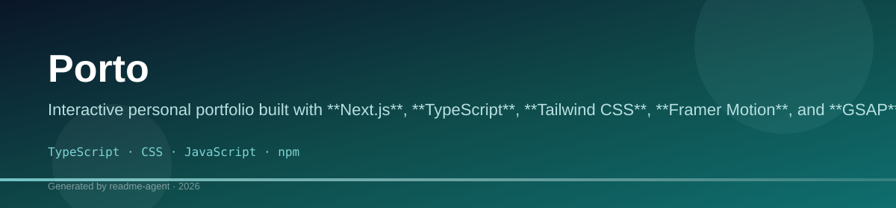
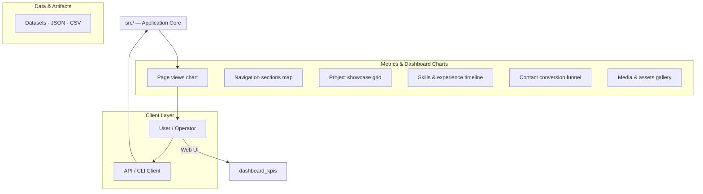
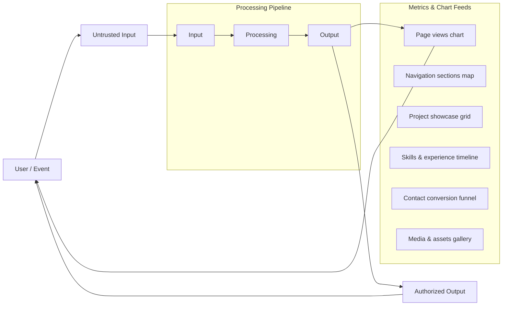
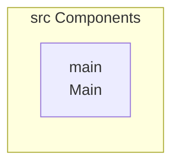
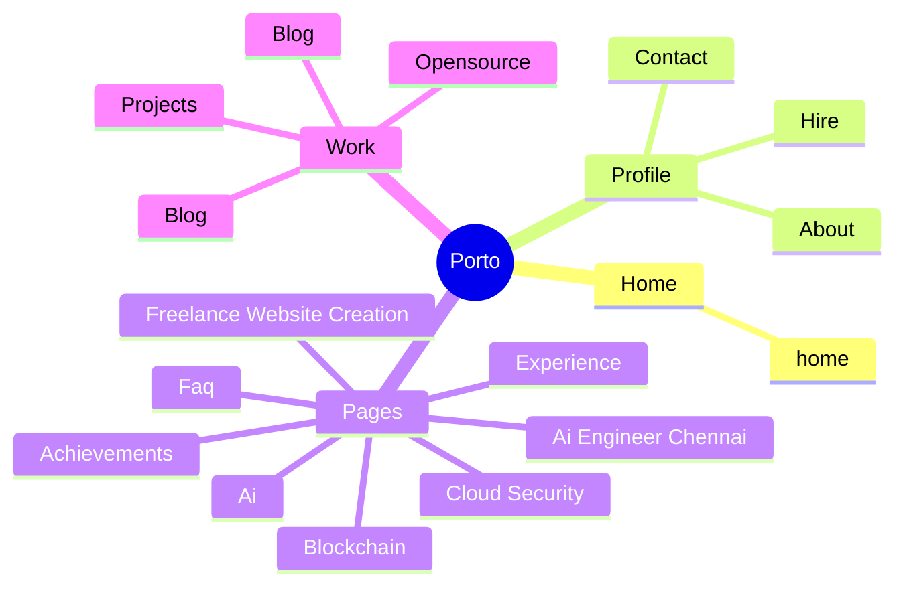
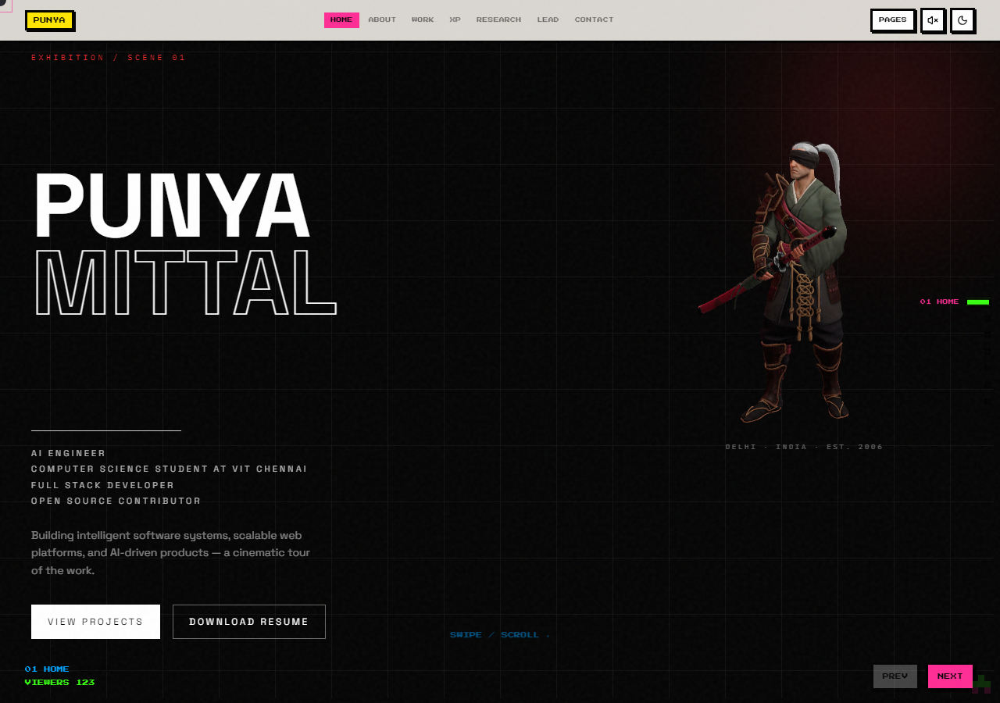

# Porto: Interactive Retro-Futuristic Portfolio

A highly interactive, retro-futuristic personal portfolio built with Next.js, featuring complex animations, a simulated terminal interface, and 3D elements.

## Overview

Porto is a sophisticated, single-page application designed to function as a personal portfolio. It emphasizes a highly interactive, immersive user experience, utilizing modern web technologies like Next.js and advanced animation libraries (GSAP, Framer Motion). The design aesthetic is described as retro-futuristic, incorporating elements such as a simulated terminal interface and complex visual effects. While the project structure suggests a focus on client-side rendering and complex state management, the underlying system diagrams hint at a potential expansion into data processing or security dashboard functionality, though the current evidence points to a consumer-facing portfolio.

## Key Features

- Interactive User Experience: The portfolio is designed to be highly engaging, incorporating visual feedback and animations.
- Terminal Simulation: Includes a simulated command-line interface for interaction.
- Advanced Animations: Utilizes libraries like GSAP and Framer Motion for complex, choreographed animations.
- 3D Visualization: Incorporates WebGL capabilities via React Three Fiber/Drei, suggesting 3D scene rendering.
- Easter Eggs: The README mentions the inclusion of interactive elements like the Konami Code and color cycling.

## Technology Stack

- Next.js
- TypeScript
- Tailwind CSS
- React
- Framer Motion
- GSAP
- React Three Fiber
- Drei

# Porto

Interactive personal portfolio built with **Next.js**, **TypeScript**, **Tailwind CSS**, **Framer Motion**, and **GSAP**.

## Technology Stack

- TypeScript
- CSS
- JavaScript
- npm

## Punya Mittal — Brutalist × Retro Portfolio

Interactive personal portfolio built with **Next.js**, **TypeScript**, **Tailwind CSS**, **Framer Motion**, and **GSAP**.

This portfolio serves as a dynamic, interactive showcase of skills and projects, utilizing modern web technologies for a unique, retro-futuristic experience.

## Tech Stack

This project leverages a robust set of technologies:

*   **Framework:** Next.js
*   **Language:** TypeScript, JavaScript
*   **Styling:** Tailwind CSS, CSS
*   **Animation:** Framer Motion, GSAP
*   **Package Manager:** npm

## Getting Started

To run this project locally, follow these steps:

### Installation

```bash
npm install
```

### Usage

This repository includes several scripts for development, building, and testing:

*   **Run Development Server:**
    ```bash
npm run dev  # next dev
```
    Open [http://localhost:3000](http://localhost:3000).
*   **Build for Production:**
    ```bash
npm run build  # next build
```
*   **Start Production Server:**
    ```bash
npm run start  # next start
```
*   **Run Linter:**
    ```bash
npm run lint  # eslint
```

## Customization

To modify the content of the portfolio, edit the data files located in the `src/data` directory. Key files include:

*   `src/data/portfolio.ts`: Edit this file for name, projects, skills, experience, and social links.

## Easter Eggs & Features

This portfolio includes several interactive elements and hidden features:

*   **Konami Code** ($↑↑↓↓←→←→$): Triggers Retro Mode and a secret achievement.
*   **Double-click logo**: Cycles through color palettes.
*   **?**: Displays keyboard shortcuts.
*   **Alt+R**: Toggles Retro Mode.
*   **Hidden pixel**: Located in the bottom-right corner.
*   **Terminal Commands**: Use commands like `help`, `projects`, `contact`, `resume`, `social`, `theme`, and `retro` within the terminal interface.

## Setup Guide

### Frontend Setup

```bash

npm install
npm run dev     # development
npm run build && npm start   # production
```

Open `http://127.0.0.1:3000` (or the port shown in the terminal).

### Running the Application

1. **Start web app** — `npm run dev` in `./`

```bash
cd .
npm install
npm run dev
```

## System Architecture

High-level system design, data flows, API map, and workflow pipelines derived from the repository structure.

### System Architecture



### Data Flow & Charts Pipeline



### Component & API Map



### Application Page Map



## Application Pages

Screenshots captured from the running application. Each page is listed with its function.

#### Home

Application page at `/`


